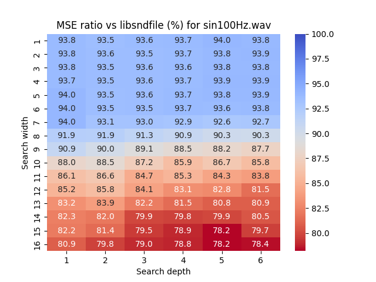
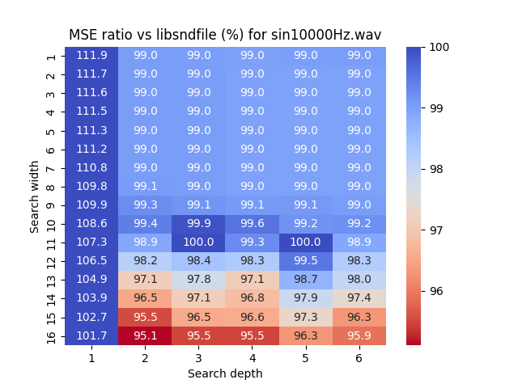
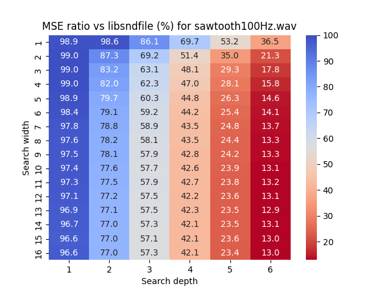
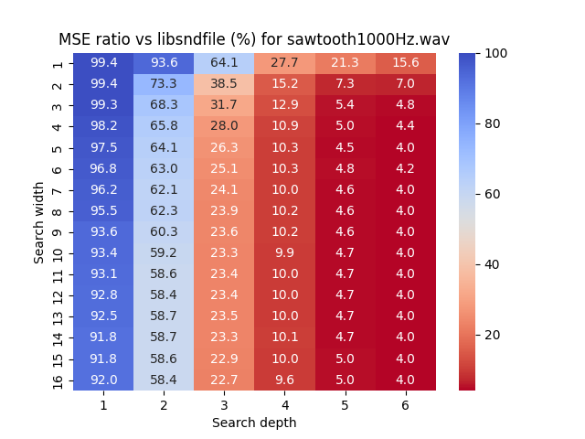
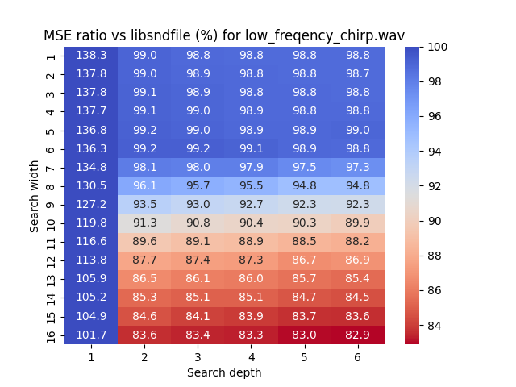
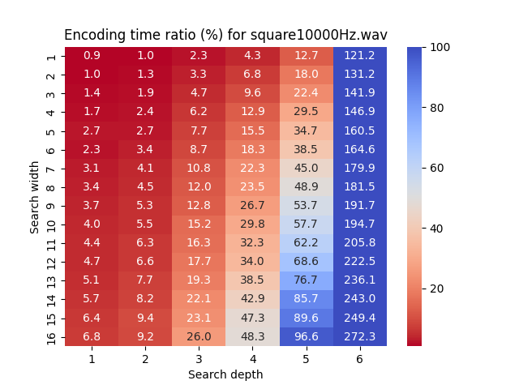
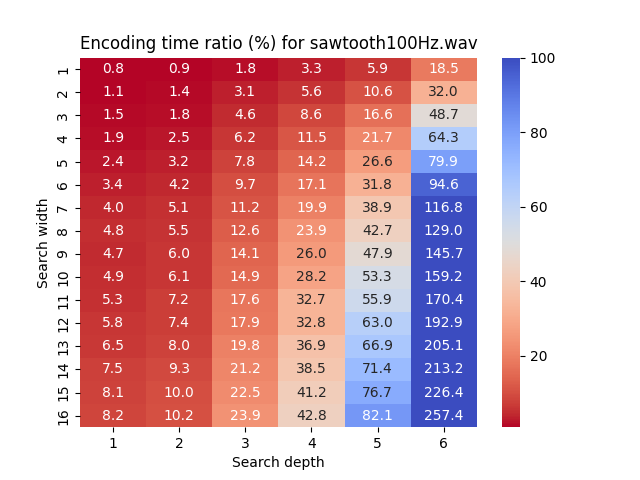
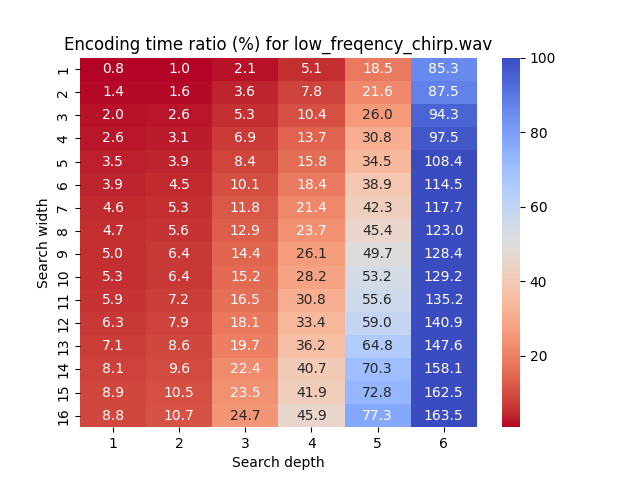
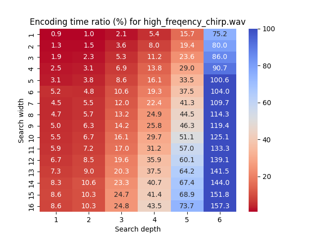

# Evaluation results

The following equations calculate the MSE ratio (%) and encoding time ratio (%):

```math
    \text{\textrm{MSE} ratio (\%)} = \frac{\text{\textrm{MSE} by MOI encoder}}{\text{\textrm{MSE} by libsoundfile encoder}} \times 100
```

```math
    \text{Encoding time ratio (\%)} = \frac{\text{encode processing time (sec)}}{\text{wave file length (sec)}} \times 100
```

The above criteria are small is better. e.g., MSE ratio = 100 (%) means MOI encoder MSE is equal to the libsoundfile one (not good).

## MSE (Mean squared error)

### sin wave






### rectangle wave


### sawtooth wave






### chirp (0 - 5000Hz, 5000 - 10000Hz)




### white noise


## Encoding time

### sin wave


### rectangle wave




### sawtooth wave




### chirp (0 - 5000Hz, 5000 - 10000Hz)





### white noise


